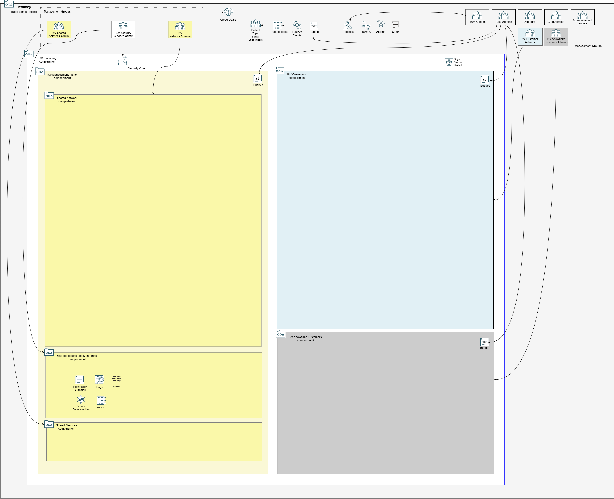

## Management Plane Foundational Stack Deployment

It assembles IAM, governance, security and observability configuration files in a single stack. 

### Typically Deployed By

Management plane administrators.

### Overall Deployment Sequence

1. **Mgmt Plane Foundational - IAM, Logging, Governance (this stack)**
2. [Mgmt Plane Networking 1st stage - Mgmt Plane VCNs](./MPLANE-NETWORKING.md#stage1)
3. [Mgmt Plane Networking - Firewall](./MPLANE-FIREWALL.md)
4. [Mgmt Plane Networking 2nd stage - Network routing post firewall deployment](./MPLANE-NETWORKING.md#stage2)
5. [Customer Onboarding](./CUSTOMER-ONBOARDING.md)

**Stack #5 must be repeated for each NEW customer onboarding.**

### Stack Configuration

Input Configuration Files | Input Dependency Files | Generated Output
--------------------------|------------------------|------------------
[bootstrap.json](../mgmt-plane/bootstrap/bootstrap.json), [iam_config.json](../mgmt-plane/iam/iam_config.json), [budgets_config.json](../mgmt-plane/governance/budgets_config.json), [cloud_guard_config.json](../mgmt-plane/security/cloud_guard_config.json), [security_zones_config.json](../mgmt-plane/security/security_zones_config.json), [scanning_config.json](../mgmt-plane/security/scanning_config.json), [observability_config.json](../mgmt-plane/observability/observability_config.json) | None | iam/output/compartments_output.json

### Stack Creation

Click the button to create the stack with all variables pre-filled:

[](https://cloud.oracle.com/resourcemanager/stacks/create?zipUrl=https://github.com/oci-landing-zones/terraform-oci-modules-orchestrator/archive/refs/heads/main.zip&zipUrlVariables={"input_config_files_urls":"https://raw.githubusercontent.com/oci-landing-zones/oci-landing-zone-operating-entities/refs/heads/master/blueprints/multi-oe/saas/runtime/mgmt-plane/bootstrap/bootstrap.json,https://raw.githubusercontent.com/oci-landing-zones/oci-landing-zone-operating-entities/refs/heads/master/blueprints/multi-oe/saas/runtime/mgmt-plane/iam/iam_config.json,https://raw.githubusercontent.com/oci-landing-zones/oci-landing-zone-operating-entities/refs/heads/master/blueprints/multi-oe/saas/runtime/mgmt-plane/security/cloud_guard_config.json,https://raw.githubusercontent.com/oci-landing-zones/oci-landing-zone-operating-entities/refs/heads/master/blueprints/multi-oe/saas/runtime/mgmt-plane/governance/budgets_config.json,https://raw.githubusercontent.com/oci-landing-zones/oci-landing-zone-operating-entities/refs/heads/master/blueprints/multi-oe/saas/runtime/mgmt-plane/observability/observability_config.json,https://raw.githubusercontent.com/oci-landing-zones/oci-landing-zone-operating-entities/refs/heads/master/blueprints/multi-oe/saas/runtime/mgmt-plane/security/scanning_config.json,https://raw.githubusercontent.com/oci-landing-zones/oci-landing-zone-operating-entities/refs/heads/master/blueprints/multi-oe/saas/runtime/mgmt-plane/security/security_zones_config.json","url_dependency_source_oci_bucket":"isv-terraform-runtime-bucket","url_dependency_source":"ocibucket","save_output":true,"oci_object_prefix":"iam/output"})

In the Resource Manager Service (RMS) **Create stack - Stack Information** screen that shows up, check the *I have reviewed and accept the Oracle Terms of Use* box, make sure to select *terraform-oci-modules-orchestrator-main/rms-facade* in the **Working directory** drop down, as shown in the image below. 

Give the stack a meaningful name in the *Name* field (*isv-saas-foundational*, for instance), and follow the RMS workflow to complete the stack creation. 

The **Create stack - Configure variables** screen shows the variables pre-filled.

In the final **Create stack - Review** screen, make sure to uncheck the *Run Apply* button, so you have a chance to inspect the Terraform plan output.

Within the stack, perform a *Plan*, inspect its output, and finally run an *Apply* to actually deploy the resources.

### What Gets Deployed

